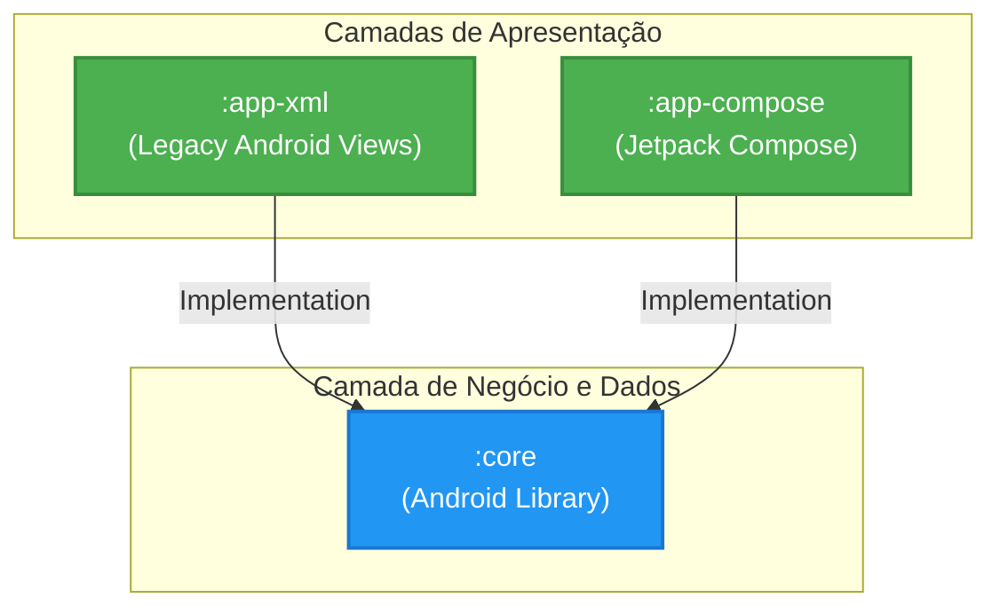

# Trabalho 3 — Refatoração Multi-Módulo e Jetpack Compose (MIP-3)

**Cadeira:** Desenvolvimento de Aplicações Móveis (DAM)  
**Estudante:** [O teu nome]  
**Data:** [A data de entrega]

---

## 1. Introdução e Justificação Técnica Profissional

Esta entrega documenta a refatoração profunda da aplicação "Dog Viewer". O monólito original foi decomposto numa arquitetura multi-módulo rigorosa e escalável, culminando no desenvolvimento paralelo de uma interface moderna e declarativa em **Jetpack Compose**. 

A principal motivação técnica desta arquitetura foi alcançar a verdadeira **Separação de Responsabilidades (SoC)** exigida por sistemas profissionais. Isolámos toda a lógica de domínio, acesso a dados (API/Cache) e gestão de estado num módulo agnóstico (`:core`). Com esta fundação sólida, provou-se ser possível manter uma aplicação legacy (`:app-xml`) e construir do zero uma nova aplicação (`:app-compose`), consumindo ambas a exata mesma Fonte Única da Verdade, com **zero duplicação de código**.

---

## 2. Diagrama de Módulos (Module Diagram)

A arquitetura atual do projeto organiza-se nas seguintes dependências restritas:

---

## 3. Contrato de UI (UI Contract)

O módulo `:core` fornece um contrato estrito aos módulos de UI. A camada de apresentação (seja Activities ou Composables) está terminantemente proibida de instanciar repositórios ou lidar com o Retrofit. Todo o fluxo de dados segue este contrato exposto pelo `DogViewModel` providenciado via `CoreInjector`:

*   **Estados Passivos (`LiveData`):**
    *   `images`: Observado pela galeria para desenhar a grelha.
    *   `isLoading`: Determina o ecrã/ícone de loading temporal.
    *   `errorMessage`: Exposto para consumo no tratamento de erros da UI.
*   **Ações Ativas (Intents/Events):**
    *   `fetchNewDogImage()`: Gatilho puramente comportamental (a UI pede, o Model gere).
    *   `addFavorite(item)` / `removeFavorite(item)`: Delegação de lógica estrita. A UI reporta a intenção do utilizador; o Core recalcula o armazenamento e dita o novo estado.
    *   `getFavoritesCount()` / `isFavorite()`: Métodos estáticos auxiliares para mapeamento.

---

## 4. Decisões Arquiteturais

Para o sucesso desta transição, apliquei os seguintes princípios académicos de Engenharia de Software:

1.  **Service Locator / DI simples (`CoreInjector`):** No modelo antigo, a View importava diretamente ficheiros de base de dados ou APIs (`ApiClient`). Esta quebra de abstração impedia testes. Ao introduzir um injetor no `:core`, a View apenas pede "uma instância do meu ViewModel" e o injetor constrói a árvore de dependências obscura (API -> Repository -> Factory -> ViewModel).
2.  **Single-Activity Architecture (Compose):** Ao contrário do módulo `:app-xml` (que possui três Activities espessas), o módulo `:app-compose` foi construído sobre uma única `MainActivity` base, usando a biblioteca `navigation-compose` para criar um grafo de rotas declarativas (`/gallery`, `/details`, `/favorites`), garantindo instâncias de ViewModel partilhadas muito mais eficientes.
3.  **Encapsulamento de Modelos:** As `data classes` de resposta HTTP e os modelos visuais da App são agora entidades geridas globalmente. Isto protege as UIs contra quebras de contrato de APIs externas.

---

## 5. Funcionalidade Exclusiva Compose (Adaptive Expansion)

> [!TIP]
> **Expansão Dinâmica de Grelha com `animateContentSize`**

Para demonstrar categoricamente o poder superior de cálculo declarativo do Jetpack Compose face ao ecossistema XML (RecyclerViews + LayoutManagers), foi desenvolvida uma funcionalidade exclusiva de **interação micro-animada**:

Quando o utilizador clica num dos *Cards* de um cão (no ecrã inicial), este não muda de janela abruptamente. O card deteta a mudança do estado interno (`isExpanded = true`) e usa o modificador paramétrico `.animateContentSize(spring(...))` para se redesenhar organicamente numa fração de segundo, revelando opções outrora escondidas (botões de Favorito Inline e de Detalhes).

**Justificação Académica:** Fazer isto no Android tradicional exige *adapters*, atualizações seletivas dispendiosas no RecyclerView, e gerir *TransitionManagers* propensos a *bugs* visuais devido à reciclagem das views. No Compose, as animações de layout são resolvidas através da árvore de nós mutável num único modificador reativo contido, sem impacto na performance estrutural, exibindo uma construção de interface substancialmente mais limpa.

---

## 6. Plano de Refatoração Executado

O plano faseado (e integralmente cumprido) que converteu a aplicação para o presente estado:

1.  **Isolamento do Core:**
    *   Criação da *Library* `:core`.
    *   Migração de *Network* (Retrofit), *Repository* e `ImageItem`.
    *   Migração e enriquecimento do `DogViewModel`.
    *   Injeção do Factory no `CoreInjector`.
2.  **Refatoração do Módulo Legacy (`:app-xml`):**
    *   Renomeação do módulo principal antigo.
    *   Limpeza extrema das `Activities`: Remoção de `Repositories` nas classes de UI.
    *   Delegação da contagem de favoritos (`count`) para o ViewModel, blindando a UI de conhecer regras de dados locais.
3.  **Desenvolvimento Declarativo (`:app-compose`):**
    *   Integração das bibliotecas nativas de UI (`compose-bom`, `material3`, `coil-compose`, `navigation-compose`).
    *   Definição de Sistema de Cores Temáticas puramente Kotlin (`Theme.kt`).
    *   Uso de grelhas nativas auto-responsivas (`LazyVerticalGrid`).
    *   Construção dos ecrãs fluídos (`DogGalleryScreen`, `DogDetailsScreen`, `FavoritesScreen`).

---

## 7. Instruções Finais de Utilização
Para compilar e testar ambas as versões da aplicação em simultâneo:
1. Sincronizar o projeto com Gradle (botão do elefante).
2. Na barra superior do Android Studio, junto ao botão de execução (Run), poderás escolher no menu suspenso:
   - `app-xml` (Executa a aplicação com os layouts XML antigos refatorados).
   - `app-compose` (Executa a nova aplicação de Jetpack Compose).
3. Confirmarás que adicionar um favorito numa app não requer duplicação de lógica para funcionar perfeitamente em ambas, validando o trabalho arquitetural.
